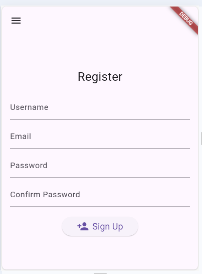
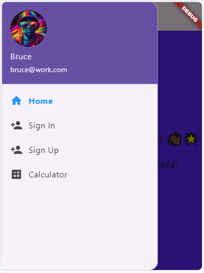
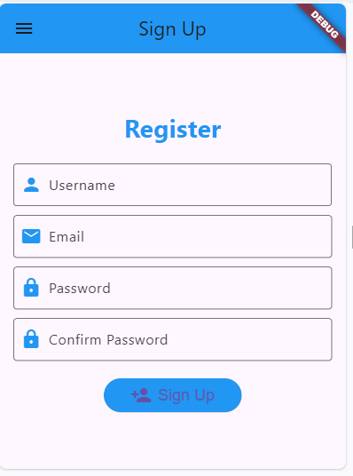
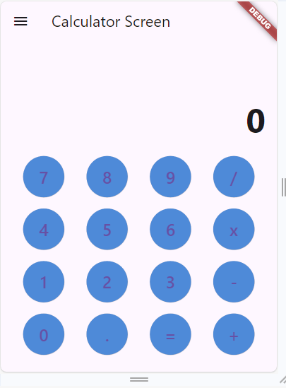

# updated_homework

A new Flutter project.

## Getting Started

This project is a starting point for a Flutter application.

A few resources to get you started if this is your first Flutter project:

- [Lab: Write your first Flutter app](https://docs.flutter.dev/get-started/codelab)
- [Cookbook: Useful Flutter samples](https://docs.flutter.dev/cookbook)

This is a Flutter application designed for managing homework tasks and providing basic functionalities like authentication and a calculator.

## Overview

The app consists of several screens and features:

- **Main Screen**: Displays a random color background and a welcoming message.
- **Sign In Screen**: Allows users to log in to their accounts.
- **Sign Up Screen**: Enables new users to create accounts.
- **Calculator Screen**: Provides a basic calculator for arithmetic operations.
- **Drawer Navigation**: A navigation drawer accessible from all screens for easy navigation between main features.

## Screenshots

## Getting Started

Follow these instructions to get a copy of the project up and running on your local machine for development and testing purposes.

### Prerequisites

- Flutter SDK: [Install Flutter](https://flutter.dev/docs/get-started/install)
- IDE VS Code (with a mobile emulator) with Flutter and Dart plugins installed
